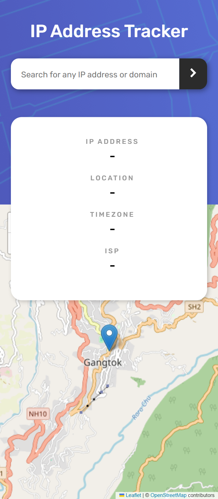
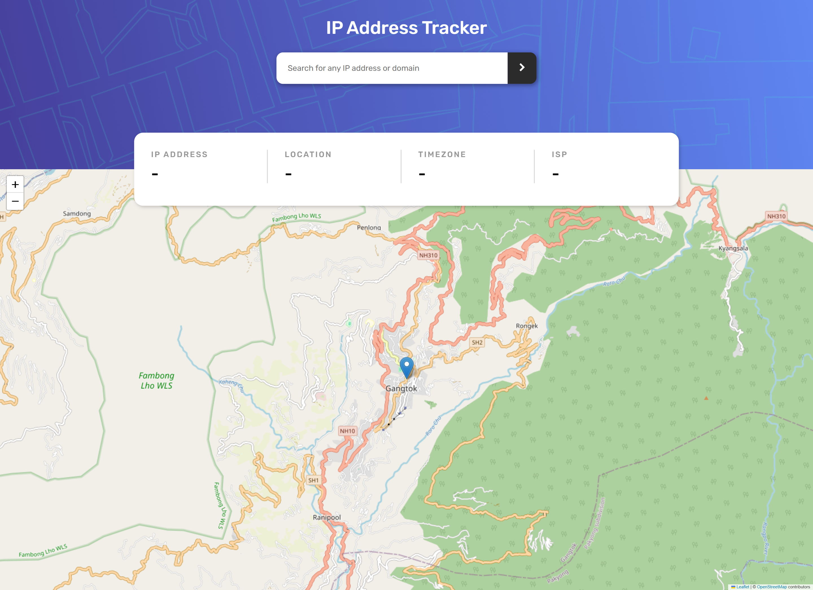

# Frontend Mentor - IP address tracker solution

This is a solution to the [IP address tracker challenge on Frontend Mentor](https://www.frontendmentor.io/challenges/ip-address-tracker-I8-0yYAH0). Frontend Mentor challenges help you improve your coding skills by building realistic projects.

## Table of contents

- [Overview](#overview)
  - [The challenge](#the-challenge)
  - [Screenshot](#screenshot)
  - [Links](#links)
- [My process](#my-process)
  - [Built with](#built-with)
  - [What I learned](#what-i-learned)
  - [Continued development](#continued-development)
  - [Useful resources](#useful-resources)
- [Author](#author)

## Overview

## Overview

The challenge was to build an IP address tracker that can be used to track the location of any IP address on a map. The application should be able to accept an IP address and display the location of that IP address on a map.

### The challenge

Users should be able to:

- View the optimal layout for each page depending on their device's screen size
- See hover states for all interactive elements on the page
- See their own IP address on the map on the initial page load
- Search for any IP addresses or domains and see the key information and location

### Screenshot




### Links

- Solution URL: [Add solution URL here](https://your-solution-url.com)
- Live Site URL: [Add live site URL here](https://your-live-site-url.com)

## My process

### Built with

- Semantic HTML5 markup
- CSS custom properties
- Flexbox

### What I learned

- How to use the Leaflet library in my project to create a map and display the location of an IP address on it.

```js
import { useState, useEffect } from "react";

import { IP_DOMAIN, IP_REGEX, startsWithNumber } from "../utils";
import { APIKEY, APIURL } from "../../config/env";

function useFetch(ipAddress) {
  const [data, setData] = useState({});
  const [loading, setLoading] = useState(false);
  const [error, setError] = useState(null);

  const queryKey = startsWithNumber.test(ipAddress) ? "ipAddress" : "domain";

  const url = `${APIURL}/country,city?apiKey=${APIKEY}&${queryKey}=${ipAddress}`;

  useEffect(
    function () {
      if (!ipAddress) return;

      if (queryKey === "domain") {
        if (!IP_DOMAIN.test(ipAddress)) return;
      } else {
        if (!IP_REGEX.test(ipAddress)) return;
      }

      const controller = new AbortController();
      const signal = controller.signal;

      async function fetchData() {
        setError(null);
        setLoading(true);

        try {
          const response = await fetch(url, { signal });

          if (!response.ok) {
            throw new Error(`Error: ${response.statusText}`);
          }

          const result = await response.json();

          if (data.code === 403) {
            throw new Error(data.messages);
          }

          setData(result);
        } catch (error) {
          if (error.name === "AbortError") {
            console.log("Fetch Aborted");
          } else {
            setError(error);
          }
        } finally {
          setLoading(false);
        }
      }

      if (IP_REGEX.test(ipAddress) || IP_DOMAIN.test(ipAddress)) {
        fetchData();
      }

      return function () {
        controller.abort();
      };
    },
    [url],
  );

  return { data, error, loading };
}

export { useFetch };
```

### Continued development

- I plan to focus on improving responsive layout techniques to ensure that my applications are adaptable to various screen sizes. ❓
- Additionally, I aim to implement functionality for fetching data when a user inputs a domain, as this feature is not yet developed in my current project. ✅

### Useful resources

- [Example resource 1](https://www.example.com)
- [Example resource 2](https://www.example.com)

## Author

- Website - [Add your name here](https://www.your-site.com)
- Frontend Mentor - [@AmanGupta1703](https://www.frontendmentor.io/profile/AmanGupta1703)
- Twitter - [@thekunalgupta17](https://www.twitter.com/thekunalgupta17)
